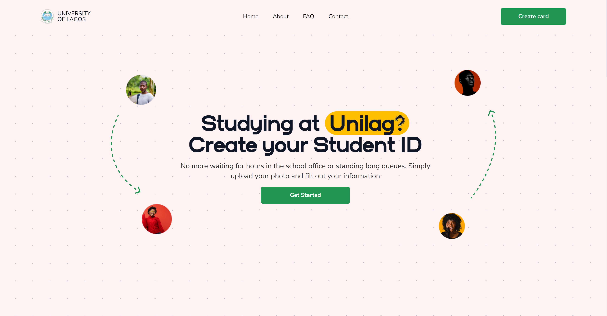

<p align="center">
    
</p>

# UNILAG ID - University Identification Card System

[](https://github.com/adelakuntobi/unilagid.com/stargazers)

This E - Voting System Was Developed With Django(Python Framework).
Feel free to make changes based on your requirements.

If you like this project, then ADD a STAR ⭐️ to this project 👆

This Voting System web application built using Django can serve as the automated voting system for organizations and/or institutions. The system works like the common election manual system of voting whereas the system must be populated by the list of the positions, candidates, and voters. The E-voting system can help a certain organization or school to minimize the voting time duration because aside providing the voters an online platform to vote, the system will automatically count the votes for each candidate. The system has 2 sides of the user interface which are the administrator and voters side. The admin user is in charge to populate and manage the data of the system and the voter side which is where the voters will choose their candidate and submit their votes.




## Features

- Automated ID card creation
- Integration with student database
- Customizable ID card templates
- User management and authentication
- Responsive and user-friendly interface

## Prerequisites

Before running the UNILAG ID system, make sure you have the following installed:

- Git Version Control: [https://git-scm.com/](https://git-scm.com/)
- Node (Package Manager): [https://nodejs.org/en](https://nodejs.org/en)
- Yarn (Package Manager): [npm install --global yarn]
  Note: **yarn** is an alternative to **npm** 

## Installation

**1. Create a folder where you want to save the project.**
**2. Clone this project**

```
$  git clone https://github.com/adelakuntobi/unilagid.com.git
```

Then, Enter the project

```
$  cd unilagid.com
```
**3. Install all the dependencies.**<br/>
Command for npm:
   ```
   $ npm install
   ```
Command for yarn:   
   ```
   $ yarn install
  ```
**4. Now, run your server**<br/>
Command for npm:
   ```
   $ npm run dev
   ```
Command for yarn:   
   ```
   $ yarn run dev
  ```

## Usage
Create a user account by registering on the UNILAG ID platform.

Log in to the UNILAG ID platform using your registered credentials.

To create an admin, navigate to https://unilagid.com/admin/create.

Input the following details for the admin:
- First Name: [Admin First Name]
- Last Name: [Admin Last Name]
- Department: [Admin Department]
- Faculty: [Admin Faculty]
- Email: [Admin Email]
- Password: [Admin Password]
- Click the "Create" button to create the admin account.

Log in to the UNILAG ID platform https://unilagid.com/admin/login using the admin credentials.

On Successful login, you can create a student with the url, https://unilagid.com/admin/student/create.


## Support
For additional assistance using this library, contact the developer experience (DX) team via [email](mailto:support@unilagid.com).

## Open to contribution ?

Yeah. Pull requests are welcomed.

## Having any issue using this ?

Please, let us know. Open up an issue.